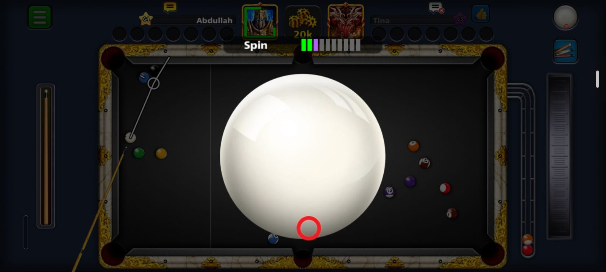
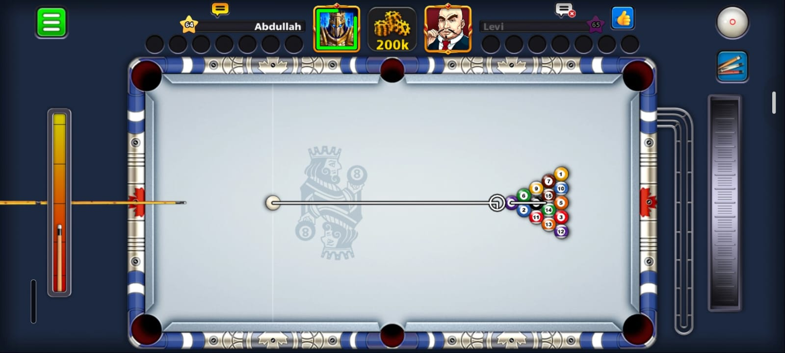
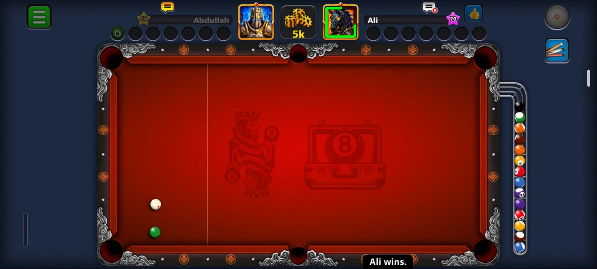
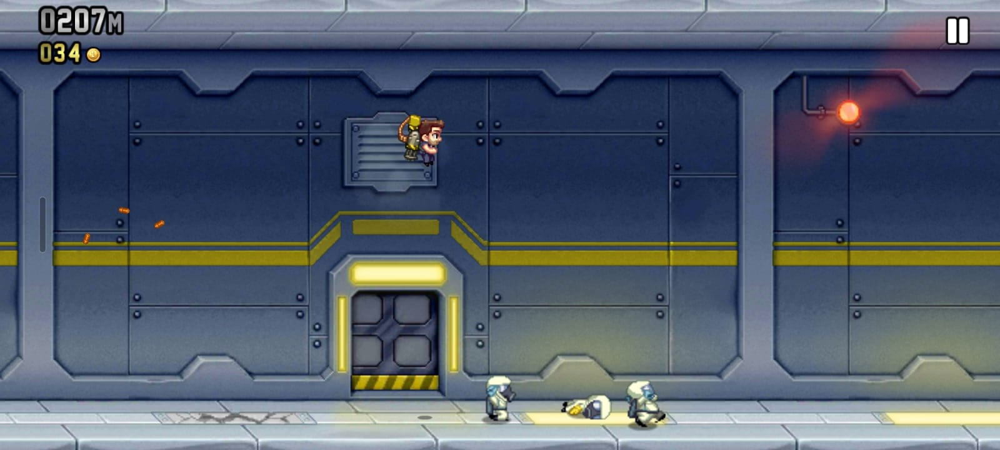
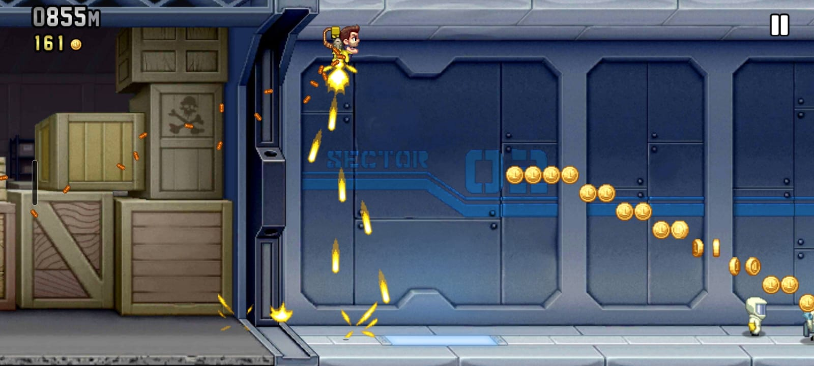
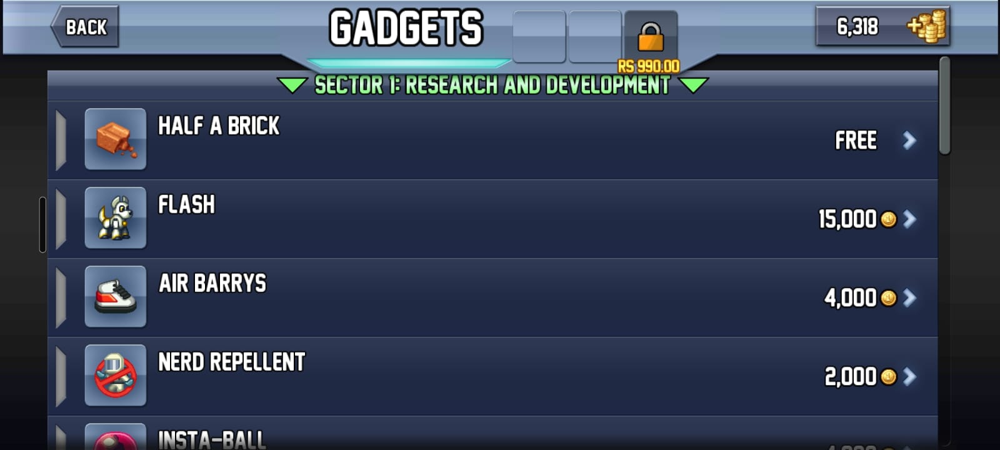
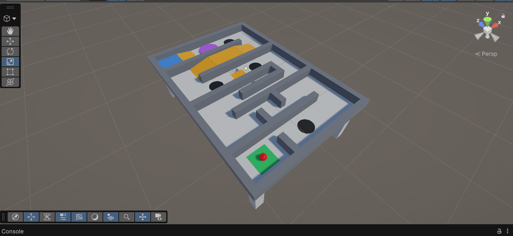
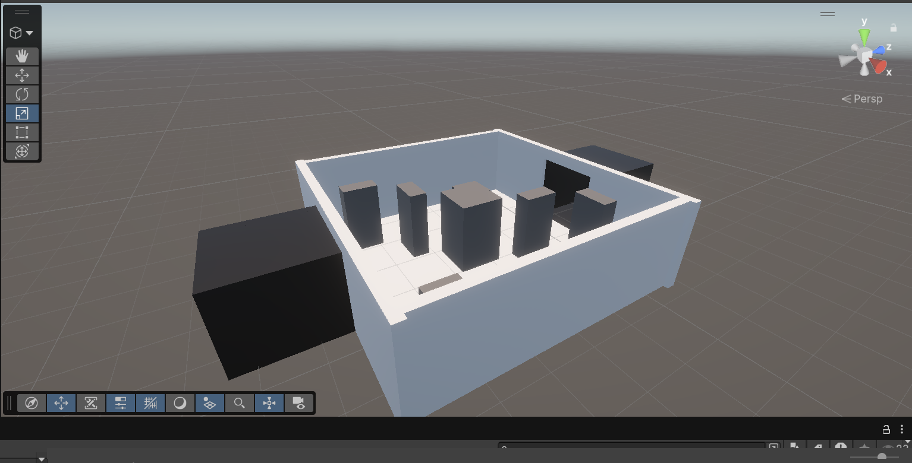
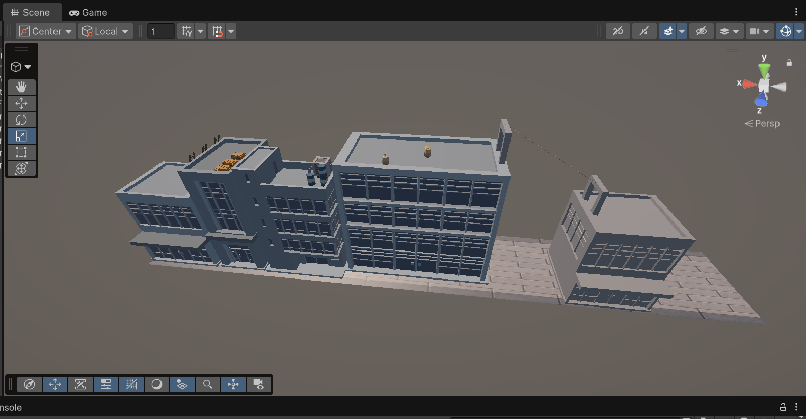

# CS464 Assignment 01 · Muhammad Abdullah · BSCS25017

## Game 1 · 8 Ball Pool

- **Store link:** https://play.google.com/store/apps/details?id=com.miniclip.eightballpool
- **Genre:** Sports / Pool
- **I played:** ~40 minutes

1. **M1, M2** · Cue power and spin adjustment
2. **M3, M4** · Shot angle and black ball outcome
3. **M5, M6, M7** · Cue-ball foul, ball colour and rail contact

| # | Mechanic | Dynamic | Aesthetic | Bartle type |
|---|---|---|---|---|
| M1 | Adjust cue power before a shot. | Players vary power based on distance and shot position. | Challenge | Achiever |
| M2 | Adjust cue-ball spin. | Players use spin to control the cue ball after contact. | Challenge | Achiever |
| M3 | Adjust the shot angle. | Players aim and correct angles to reach the pocket. | Challenge | Achiever |
| M4 | Potting the black ball decides the outcome. | Players choose when to attempt the final ball based on risk. | Challenge | Achiever |
| M5 | Potting the cue ball causes a foul. | Players avoid shots that could pocket the cue ball. | Challenge | Achiever |
| M6 | First successful pot assigns solids or stripes. | Players adapt their strategy to their assigned ball group. | Challenge | Achiever |
| M7 | A legal shot must pot a ball or contact a rail. | Players plan shots to satisfy the rail or potting requirement. | Challenge | Achiever |

**Aesthetic profile:** Challenge — precise aiming and shot planning. Expression — players use different aiming, power and spin techniques. Discovery — players learn how shot combinations behave.

**Player types**
- **Primary:** Achiever (Acting × World), because players work toward winning and completing the game objectives.
- **Secondary:** Killer (Acting × Players), because matches involve directly competing against another player.

---

## Game 2 · Jetpack Joyride

- **Store link:** https://play.google.com/store/apps/details?id=com.halfbrick.jetpackjoyride
- **Genre:** Action / Endless Runner
- **I played:** 1+ hour

1. **M1, M2** · Jetpack control and gravity
2. **M3, M4** · Coins and hazards
3. **M5, M6, M7** · Machine parts, distance and gadgets

| # | Mechanic | Dynamic | Aesthetic | Bartle type |
|---|---|---|---|---|
| M1 | Touch activates the jetpack. | Players tap and release to control vertical movement. | Challenge | Achiever |
| M2 | Gravity pulls the player downward. | Players time jetpack use to maintain a safe height. | Challenge | Achiever |
| M3 | Coins are placed along the route. | Players change their path to collect coins. | Challenge | Achiever |
| M4 | Obstacles, lasers and missiles cause danger. | Players change position and timing to avoid hazards. | Challenge | Achiever |
| M5 | SAM machine parts can be collected. | Players move toward parts while managing hazards. | Discovery | Explorer |
| M6 | Distance is measured in metres. | Players try to survive longer and beat their distance record. | Challenge | Achiever |
| M7 | Gears unlock gadgets. | Players collect gears to access different equipment. | Discovery | Explorer |

**Aesthetic profile:** Challenge — avoiding hazards and surviving longer. Discovery — finding collectibles and equipment. Expression — using different gadgets and gameplay options.

**Player types**
- **Primary:** Achiever (Acting × World), because players try to survive longer, collect items and improve their score.
- **Secondary:** Explorer (Interacting × World), because players discover collectibles, gadgets and different gameplay possibilities.

---

## 🎮 Proposed Game Blockouts

### 1. Tilt Maze Ball

A physics-based maze where the player tilts a platform to guide a ball through obstacles toward the goal.

### 2. FPS Training Arena

A first-person shooting arena designed for target practice, movement, cover and obstacles.

### 3. Rooftop Parkour × Endless Runner

A fast-paced rooftop parkour game where the player runs across buildings, jumps gaps and avoids obstacles.

